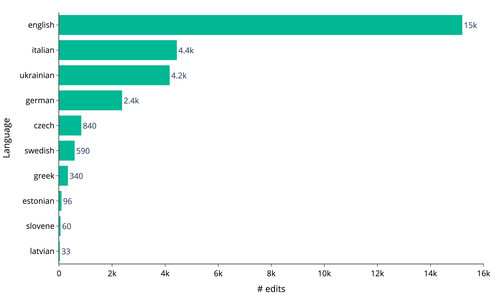

# WikiEdits-MultiGEC

## Overview
WikiEdits-MultiGEC is a small dataset of human error corrections made by Wikipedia contributors for eleven languages.
It is a collection of scripts for automatic extraction of edits from Wikipedia.\
❤️ Support the project by starring the repo.

## Road Map
- [ ] Refactor existing Jupyter notebooks into a reusable Python package for better structure and maintainability.
- [ ] Develop a system to ensure all scripts can be executed automatically one time per week/month.
- [ ] Set up an additional process for annotating datasets to improve dataset for model training.
- [ ] Integrate additional low-resource languages to broaden the project’s multilingual capabilities.

## Corpus
The dataset is a part of [OmniGEC](https://huggingface.co/collections/lang-uk/omnigec-68095391ebef195ed6c0a5f3) -
the collection of multilingual silver-standard datasets and models for the task of Grammatical Error Correction (GEC).
You can find data on [HuggingFace WikiEdits-MultiGEC](https://huggingface.co/datasets/lang-uk/WikiEdits-MultiGEC).

The corpus has been prepared for 11 languages:

| Language  | Code  | WikiPage                                                                                                                               | Recent Changes                                                                                                                                                                                                                                                                                                                |
|-----------|-------|----------------------------------------------------------------------------------------------------------------------------------------|-------------------------------------------------------------------------------------------------------------------------------------------------------------------------------------------------------------------------------------------------------------------------------------------------------------------------------|
| Czech     | `cs`  | [Czech](https://cs.wikipedia.org/wiki/Hlavn%C3%AD_strana)                                                                              | [Czech](https://cs.wikipedia.org/w/index.php?hidebots=1&hidecategorization=1&hideWikibase=1&tagfilter=newcomer+task+copyedit&limit=50&days=7&title=Speci%C3%A1ln%C3%AD:Posledn%C3%AD_zm%C4%9Bny&urlversion=2)                                                                                                                 |
| English   | `en`  | [English](https://en.wikipedia.org/wiki/Main_Page)                                                                                     | [English](https://en.wikipedia.org/w/index.php?hidebots=1&hidecategorization=1&hideWikibase=1&tagfilter=newcomer+task+copyedit&limit=50&days=7&title=Special:RecentChanges&urlversion=2)                                                                                                                                      |
| Estonian  | `et`  | [Estonian](https://et.wikipedia.org/wiki/Vikipeedia:Esileht)                                                                           | [Estonian](https://et.wikipedia.org/w/index.php?hidebots=1&hidecategorization=1&hideWikibase=1&tagfilter=newcomer+task+copyedit&limit=50&days=7&title=Eri:Viimased_muudatused&urlversion=2)                                                                                                                                   |
| German    | `de`  | [German](https://de.wikipedia.org/wiki/Wikipedia:Hauptseite)                                                                           | [German](https://de.wikipedia.org/w/index.php?hidebots=1&hidecategorization=1&hideWikibase=1&tagfilter=newcomer+task+copyedit&limit=50&days=7&title=Spezial:Letzte_%C3%84nderungen&urlversion=2)                                                                                                                              |
| Greek     | `el`  | [Greek](https://el.wikipedia.org/wiki/%CE%95%CE%BB%CE%BB%CE%B7%CE%BD%CE%B9%CE%BA%CE%AE_%CE%B3%CE%BB%CF%8E%CF%83%CF%83%CE%B1)           | [Greek](https://el.wikipedia.org/w/index.php?hidebots=1&hidecategorization=1&hideWikibase=1&tagfilter=newcomer+task+copyedit&limit=50&days=7&title=%CE%95%CE%B9%CE%B4%CE%B9%CE%BA%CF%8C:%CE%A0%CF%81%CF%8C%CF%83%CF%86%CE%B1%CF%84%CE%B5%CF%82%CE%91%CE%BB%CE%BB%CE%B1%CE%B3%CE%AD%CF%82&urlversion=2)                        |
| Icelandic | `is`  | [Icelandic](https://is.wikipedia.org/wiki/Fors%C3%AD%C3%B0a)                                                                           | [Icelandic](https://is.wikipedia.org/w/index.php?hidebots=1&hidecategorization=1&hideWikibase=1&tagfilter=newcomer+task&limit=50&days=7&title=Kerfiss%C3%AD%C3%B0a:N%C3%BDlegar_breytingar&urlversion=2)                                                                                                                      |
| Italian   | `it`  | [Italian](https://it.wikipedia.org/wiki/Pagina_principale)                                                                             | [Italian](https://it.wikipedia.org/w/index.php?hidebots=1&hidecategorization=1&hideWikibase=1&tagfilter=newcomer+task+copyedit&limit=50&days=7&title=Speciale:UltimeModifiche&urlversion=2)                                                                                                                                   |
| Latvian   | `lv`  | [Latvian](https://lv.wikipedia.org/wiki/Special:SpecialPages)                                                                          | [Latvian](https://lv.wikipedia.org/w/index.php?hidebots=1&hidecategorization=1&hideWikibase=1&tagfilter=newcomer+task+copyedit&limit=50&days=7&title=Special:RecentChanges&urlversion=2)                                                                                                                                      |
| Slovene   | `sl`  | [Slovene](https://sl.wikipedia.org/wiki/Posebno:PosebneStrani)                                                                         | [Slovene](https://sl.wikipedia.org/w/index.php?hidebots=1&hidecategorization=1&hideWikibase=1&tagfilter=newcomer+task+copyedit&limit=50&days=7&title=Posebno:ZadnjeSpremembe&urlversion=2)                                                                                                                                    |
| Swedish   | `sv`  | [Swedish](https://sv.wikipedia.org/wiki/Portal:Huvudsida)                                                                              | [Swedish](https://sv.wikipedia.org/w/index.php?hidebots=1&hidecategorization=1&hideWikibase=1&tagfilter=newcomer+task+copyedit&limit=50&days=7&title=Special:Senaste_%C3%A4ndringar&urlversion=2)                                                                                                                             |
| Ukrainian | `uk`  | [Ukrainian](https://uk.wikipedia.org/wiki/%D0%93%D0%BE%D0%BB%D0%BE%D0%B2%D0%BD%D0%B0_%D1%81%D1%82%D0%BE%D1%80%D1%96%D0%BD%D0%BA%D0%B0) | [Ukrainian](https://uk.wikipedia.org/w/index.php?hidebots=1&hidecategorization=1&hideWikibase=1&tagfilter=newcomer+task+copyedit&limit=50&days=7&title=%D0%A1%D0%BF%D0%B5%D1%86%D1%96%D0%B0%D0%BB%D1%8C%D0%BD%D0%B0:%D0%9D%D0%BE%D0%B2%D1%96_%D1%80%D0%B5%D0%B4%D0%B0%D0%B3%D1%83%D0%B2%D0%B0%D0%BD%D0%BD%D1%8F&urlversion=2) |

## Statistics

- [Number of pages](metadata/pages.json)
- [Number of edits (all)](metadata/corrections.json)
- [Number of edits](metadata/corrections_clean.json)

## How to use

TBD

## Reference
If you use or discuss this dataset in your work, please cite our paper:\

TBD

## Contact
If you have a technical question regarding the dataset or publication, please create an issue in this repository.
